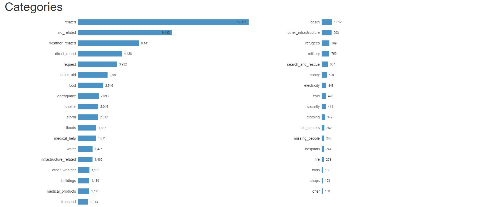
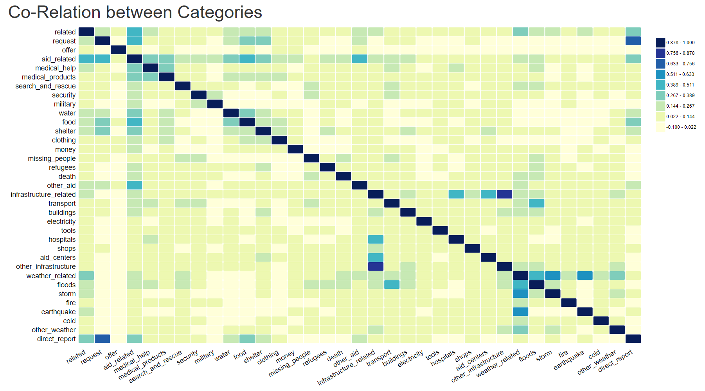
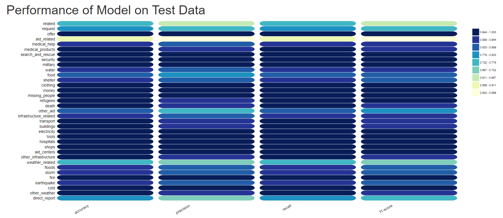

# Disaster Response Pipeline Project
Classify messages, received during a disaster, into appropriate categories so relevant teams can help.

## Table of Contents
 <ol>
   <li><a href="#head1"> Libraries and tools used</a>
   <li><a href="#head2"> Motivation of the project </a>
   <li><a href="#head3"> Directory structure </a>
   <li><a href="#head4"> Instructions </a>
   <li><a href="#head5"> Summary of the results </a>
   <li><a href="#head6"> Acknowledgements </a>
   <li><a href="#head7"> Author </a>
</ol>

<h2 id="head1"> Libraries and tools used: </h2>
<ul>
 <li> NumPy
 <li> pandas
 <li> NLTK
 <li> pickle
 <li> SQLAlchemy 
 <li> scikit-learn
 <li> Flask    
 <li> d3
</ul>

<h2 id="head2"> Motivation of the project</h2>

To apply NLP skills learned as part of Udacity Data Science Nanodegree lesson to classify messages received during a disaster. It will allow relevant teams to get the message quickly and act accordingly.  

<h2 id="head3"> Directory structure </h3>

```
.
├── app                                 # Code for web app
    ├── static                          # Static images and JS files
        ├── img                         # Images used in web app
            ├── githublogo.png          # github logo
            ├── linkedinlogo.png        # linkedin logo
        ├── js                          # JS files used in web app
            ├── d3-v4.js                # d3 file
            ├── DisasterResponse.js     # JS file for visualization and sending AJAX requests to get predictions
    ├── templates                       # Template files for web app
        ├── master.html                 # HTML for index page
    ├── run.py                          # Python file to run the web app
├── data                                # Data files 
    ├── disaster_messages.csv           # All disaster messages, with non-English messages translated in English
    ├── disaster_categories.csv         # Categories for all messages
    ├── DisasterResponse.db             # SQLite Database created through process_data.py file
    ├── process_data.py                 # Python file to clean, transform CSV data and store in database file
├── models                              # Model files                  
    ├── train_classifier.py             # Python file to train a model, evaluate it, and save it in a pickle file
    ├── classifier.pkl                  # Pickle file with saved model
├── screen_shots                        # Screen shots from web app
    ├── categories                      # Bar chart for all categories
    ├── corelation                      # Heat Map for co-relation between categories
    ├── performance                     # Heat Map to show performance of model
├── LICENSE                             # License file
├── README.md                           # ReadMe file

```
<h2 id="head4"> Instructions </h2>
1. Run the following commands in the project's root directory to set up your database and model.

    - To run ETL pipeline that cleans data and stores in database
        `python data/process_data.py data/disaster_messages.csv data/disaster_categories.csv data/DisasterResponse.db`
    - To run ML pipeline that trains classifier and saves
        `python models/train_classifier.py data/DisasterResponse.db models/classifier.pkl`

2. Run the following command in the app's directory to run your web app.
    `python run.py`

3. Go to http://127.0.0.1:3001/

<h2 id="head5"> Summary of the results </h2>
Below are few charts summarizing the results. These charts as well a working model can be accessed at https://disaster-webapp-viz.herokuapp.com/

Chart belows the distribution of categories in the training data. As can be seen some categories are assigned to very few meesages thus creating data imbalance.


Chart below shows the co-relation between categories. As can be seen some categories are co-related. 'request' with 'aid_related' and 'direct_report'. 'aid_related'


Chart below shows the performance of the model across categories


<h2 id="head6"> Acknowledgements </h2>

<ul>
 <li> Udacity https://www.udacity.com/
 <li> Figure Eight https://appen.com/datasets/combined-disaster-response-data/
</ul>

<h2 id="head7"> Author </h2>

Shahzeb Akhtar

https://www.linkedin.com/in/shahzebakhtar/


